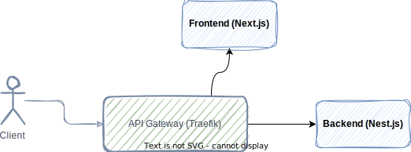

# MVP Sample Application

This project show you how to start an MVP application with open source libraries and frameworks.



<a href="https://app.diagrams.net/#Hvahidzafari%2Fmvp-sample%2Fmain%2Fdiagram.drawio" target="_blank">
  Edit in diagrams.net
</a>

## Getting Started

First, run the development server:

```bash
docker-compose up --build -d
```

We serve Traefik Panel on port 8080, But be careful that we serve frontend on port 80, So if port 80 is reserved in your system you should map another port for your Traefik service in the docker-compose.yml file.

```yml
reverse-proxy:
  container_name: traefik
  image: traefik
  ports:
    - "<another port>:80"
    - "8080:8080"
```

- Check out Frontend [http://localhost](http://localhost).
- Check out Traefik Panel [http://localhost:8080/](http://localhost:8080/) for more information.

## Wiki

For more information you can use [Wiki](https://github.com/vahidzafari/mvp-sample/wiki) link.
